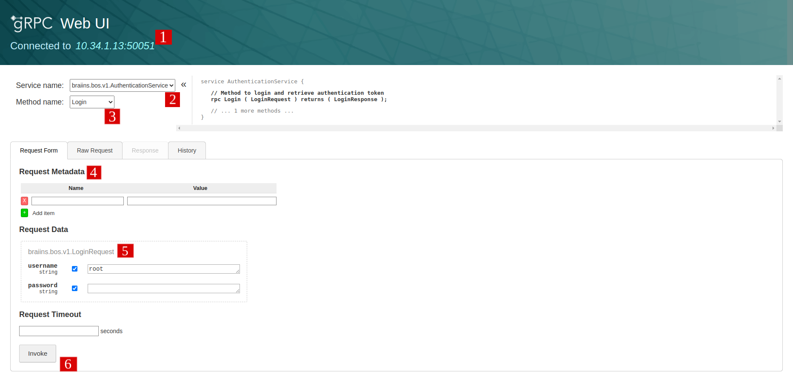

### Notes on This Structure

- **protos/**: Holds `.proto` definitions for your service interface.
- **server/**: Contains all server-side logic—entry point, service implementations, database setup, configuration, utilities, and any interceptors or instrumentation.
- **tests/**: Houses both unit and integration tests.


## Dependencies & Tooling

### Python Dependencies

`requirements.txt` (pinned versions for reproducibility):

```text
annotated-types==0.7.0
certifi==2024.12.14
charset-normalizer==3.4.0
clickhouse-connect==0.8.10
colorama==0.4.6
Deprecated==1.2.15
dnspython==2.7.0
email_validator==2.2.0
googleapis-common-protos==1.66.0
grpcio==1.68.1
grpcio-health-checking==1.68.1
grpcio-reflection==1.68.1
grpcio-tools==1.68.1
idna==3.10
importlib_metadata==8.5.0
iniconfig==2.0.0
lz4==4.3.3
opentelemetry-api==1.29.0
opentelemetry-exporter-otlp==1.29.0
opentelemetry-exporter-otlp-proto-common==1.29.0
opentelemetry-exporter-otlp-proto-grpc==1.29.0
opentelemetry-exporter-otlp-proto-http==1.29.0
opentelemetry-instrumentation==0.50b0
opentelemetry-instrumentation-grpc==0.50b0
opentelemetry-proto==1.29.0
opentelemetry-sdk==1.29.0
opentelemetry-semantic-conventions==0.50b0
packaging==24.2
pluggy==1.5.0
protobuf==5.29.1
pydantic==2.10.3
pydantic-settings==2.7.0
pydantic_core==2.27.1
pytest==8.3.4
python-dotenv==1.0.1
pytz==2024.2
requests==2.32.3
typing_extensions==4.12.2
urllib3==2.2.3
wrapt==1.17.0
zipp==3.21.0
zstandard==0.23.0
```

### Makefile

A Makefile can simplify common tasks like generating protos, running tests, formatting code:

```makefile
PROTOC = python -m grpc_tools.protoc
PROTOS_PATH = protos
OUT_PATH = .

.PHONY: generate-protos
generate-protos:
	$(PROTOC) -I=$(PROTOS_PATH) --python_out=$(OUT_PATH) --grpc_python_out=$(OUT_PATH) $(PROTOS_PATH)/myservice.proto

.PHONY: test
test:
	pytest --asyncio-mode=auto

.PHONY: format
format:
	black .
	isort .
	mypy .
```

## Protobuf Definition

`protos/myservice.proto` defines your service contract. Let’s assume a `UserService`:

```proto
syntax = "proto3";

package api.v1;

option go_package = "api/v1"; // For language interoperability

message User {
  int64 id = 1;
  string username = 2;
  string email = 3;
}

message GetUserRequest {
  int64 user_id = 1;
}

message GetUserResponse {
  User user = 1;
}

message ListUsersRequest {
  int32 page = 1;
  int32 page_size = 2;
}

message ListUsersResponse {
  repeated User users = 1;
  int32 total = 2;
}

message InsertUserRequest {
  string username = 1;
  string email = 2;
}

// Define the Empty message here
message Empty {}

service UserService {
  rpc GetUser(GetUserRequest) returns (GetUserResponse);
  rpc ListUsers(ListUsersRequest) returns (ListUsersResponse);
  rpc InsertUser(InsertUserRequest) returns (Empty);
}
```
### Generating Python Code

Makefile:

```makefile
# Makefile for Python gRPC example project

# Protobuf Definition
PROTOC = python -m grpc_tools.protoc

# Paths to protos and generated files
PROTOS = myservice.proto
# PROTOC_FLAGS = --python_out=. --grpc_python_out=. myservice.proto
OUT_PATH = .

# Rules for generating protobuf files
.PHONY: generate-protos
generate-protos:
	$(PROTOC) -I=. --python_out=$(OUT_PATH) --grpc_python_out=$(OUT_PATH) $(PROTOC_FLAGS) $(PROTOS)

# Rules for running tests
.PHONY: test
test:
	pytest --asyncio-mode=auto
```

Run `make generate-protos` to generate Python code from the `.proto` file.

```bash
$ make generate-protos
```
This will generate `myservice_pb2.py` and `myservice_pb2_grpc.py` files in the current directory.

## Configuration Management

`server/config.py`:

```python
"""
Settings module for the server
"""
from functools import lru_cache

from pydantic_settings import BaseSettings, SettingsConfigDict

# Define the Settings class
class Settings(BaseSettings):
    # For ClickHouse connection
    CLICKHOUSE_HOST: str
    CLICKHOUSE_PORT: int
    CLICKHOUSE_USER: str
    CLICKHOUSE_PASSWORD: str
    CLICKHOUSE_DATABASE: str
    # For gRPC server connection
    GRPC_SERVER_HOST: str
    GRPC_SERVER_PORT: int
    # For gRPC protocol
    SERVICE_NAME: str
    REQUESTS_TOTAL_DESCRIPTION: str
    OTEL_EXPORTER_OTLP_TRACES_ENDPOINT:str
    OTEL_EXPORTER_OTLP_TRACES_PROTOCOL:str
    OTEL_EXPORTER_OTLP_METRICS_ENDPOINT:str
    OTEL_EXPORTER_OTLP_METRICS_PROTOCOL:str
    OTEL_EXPORTER_OTLP_ENDPOINT:str
    OTEL_EXPORTER_OTLP_PROTOCOL:str
     # Define the model_config property for environment variables
    model_config = SettingsConfigDict(
        env_file='.env', env_file_encoding='utf-8')

# Define the cached_setting function and cache the result
@lru_cache
def cached_setting():
    """
    Returns a cached instance of the Settings class.

    This function is decorated with @lru_cache to ensure that only one instance
    of the Settings class is created and reused. This is useful to avoid loading
    the environment variables and configuration files multiple times.

    Returns:
        Settings: An instance of the Settings class.
    """
    return Settings()

settings: Settings = cached_setting()
```

### Environment Variables

`.env`:

```bash
# .env
CLICKHOUSE_HOST=chnode1
CLICKHOUSE_PORT=8123
CLICKHOUSE_USER=default
CLICKHOUSE_PASSWORD=
CLICKHOUSE_DATABASE=default
GRPC_SERVER_HOST=0.0.0.0
GRPC_SERVER_PORT=50051
# For gRPC protocol
OTEL_EXPORTER_OTLP_ENDPOINT=otel-collector:4317
OTEL_EXPORTER_OTLP_PROTOCOL=grpc
OTEL_EXPORTER_OTLP_TRACES_ENDPOINT=otel-collector:4317
OTEL_EXPORTER_OTLP_TRACES_PROTOCOL=grpc
OTEL_EXPORTER_OTLP_METRICS_ENDPOINT=otel-collector:4317
OTEL_EXPORTER_OTLP_METRICS_PROTOCOL=grpc
SERVICE_NAME=myservice
REQUESTS_TOTAL_DESCRIPTION=functions
```

## Dynamic ClickHouse Handler

`server/ch_handler.py`:

```python   
import inspect
import clickhouse_connect
from typing import Any, Dict, List, Optional
from server import setup_logging

logger = setup_logging()

class ClickhouseHandler:
    def __init__(self, host: str, port: int, user: str, password: str, database: str):
        """
        Initializes a ClickhouseHandler instance with connection details.

        Args:
            host (str): The hostname or IP address of the ClickHouse server.
            port (int): The port number of the ClickHouse server.
            user (str): The username to use for authentication.
            password (str): The password to use for authentication.
            database (str): The name of the ClickHouse database to use.
        """
        self.client = clickhouse_connect.get_client(
            host=host,
            port=port,
            username=user,
            password=password,
            database=database
        )
    def close(self) -> None:
        self.client.close()

    def select(self, query: str, params: Optional[Dict[str, Any]] = None) -> List[Dict[str, Any]]:
        """Executes a dynamic query on the database.

        Args:
            query: The SQL query to execute. It can contain placeholders for parameters.
            params: A dictionary of parameters to pass to the query.

        Returns:
            A list of dictionaries where each dictionary represents a row in the result set.
        """
        try:
            rows = self.client.query(query, parameters=params)
            # Convert rows to list of dict since clickhouse-connect returns a special result object
            result = [dict(zip(rows.column_names, row)) for row in rows.result_set]
            return result
        except Exception as e:
            class_name = self.__class__.__name__  # Retrieve class name
            method_name = inspect.currentframe().f_code.co_name  # Retrieve method name
            logger.error(
                f"Error executing query in {class_name}.{method_name}: {e}",
                exc_info=True  # Logs the exception traceback
            )
            raise
        finally:
            self.client.close()

    def insert(self, table: str, data: List[tuple]) -> None:
        # Use table name directly and pass data
        """
        Inserts data into the specified table in the ClickHouse database.

        Args:
            table (str): The name of the table into which data should be inserted.
            data (List[tuple]): A list of tuples, where each tuple represents a row of data to insert.

        Returns:
            None
        """
        try:
            self.client.insert(table, data)
        except Exception as e:
            class_name = self.__class__.__name__  # Retrieve class name
            method_name = inspect.currentframe().f_code.co_name  # Retrieve method name
            logger.error(
                f"Error executing query in {class_name}.{method_name}: {e}",
                exc_info=True  # Logs the exception traceback
            )
            raise
        finally:
            self.client.close()

    def execute(self, query: str, params: Optional[Dict[str, Any]] = None) -> None:
        # For non-SELECT/INSERT queries (e.g. CREATE, DROP)
        """
        Executes a dynamic query on the database that is not a SELECT/INSERT query.

        Args:
            query: The SQL query to execute. It can contain placeholders for parameters.
            params: A dictionary of parameters to pass to the query.

        Returns:
            None

        Raises:
            Exception: If the query execution fails, an exception is raised with the error message.
        """
        try:
            self.client.command(query, parameters=params)
        except Exception as e:
            class_name = self.__class__.__name__  # Retrieve class name
            method_name = inspect.currentframe().f_code.co_name  # Retrieve method name
            logger.error(
                f"Error executing query in {class_name}.{method_name}: {e}",
                exc_info=True  # Logs the exception traceback
            )
            raise
        finally:
            self.client.close()
```

**Note on async usage:** If you need fully async operations, consider running queries in an `asyncio.to_thread()` call, or check if `clickhouse-connect` has async support in the version you use. The above code is synchronous. For a production scenario, you might wrap queries in `await asyncio.to_thread(...)` calls within your gRPC service methods.

## Pydantic Models for Request Validation

We’ll define Pydantic models for each RPC request. Pydantic v2+ encourages using `Field` and `RootModel` or `BaseModel` directly.

For example, suppose we have a gRPC method that retrieves a list of users from ClickHouse. Let’s define a Pydantic model for the request parameters. The `.proto` might define something like:

```proto
message RetrieveUsersRequest {
  repeated User user_ids = 1;
}
```

We can define a Pydantic model like this:

```python
"""
server/models.py 
"""
from pydantic import BaseModel, field_validator, EmailStr
from pydantic_core import PydanticCustomError

class CValueError(PydanticCustomError):
    def __init__(self, code: str, message: str):
        super().__init__(code, message)

class GetUserRequestModel(BaseModel):
    user_id: int

    @field_validator("user_id")
    def check_user_id(cls, v)-> int | CValueError:
        """
        Validate that the user_id is positive.

        This validator checks if the `user_id` field is greater than 0.
        If the value is less than or equal to 0, it raises a `CValueError`.

        :param v: The value of the user_id field.
        :return: The validated user_id if it is positive.
        :raises CValueError: If user_id is less than or equal to 0.
        """
        if v <= 0:
            raise CValueError("value_error", "User ID must be positive")
        return v

class ListUsersRequestModel(BaseModel):
    page: int = 1
    page_size: int = 10

    @field_validator("page")
    def validate_page(cls, v)-> int | CValueError:
        """
        Validate that the page is greater than or equal to 1.

        This validator checks if the `page` field is greater than or equal to 1.
        If the value is less than 1, it raises a `CValueError`.

        :param v: The value of the page field.
        :return: The validated page if it is greater than or equal to 1.
        :raises CValueError: If page is less than 1.
        """
        if v < 1:
            raise CValueError("value_error", "Page must be >= 1")
        return v

    @field_validator("page_size")
    def validate_page_size(cls, v)-> int | CValueError:
        """
        Validate that the page_size is greater than 0.

        This validator checks if the `page_size` field is greater than 0.
        If the value is less than or equal to 0, it raises a `CValueError`.

        :param v: The value of the page_size field.
        :return: The validated page_size if it is greater than 0.
        :raises CValueError: If page_size is less than or equal to 0.
        """
        if v <= 0:
            raise CValueError("value_error", "Page size must be > 0")
        return v

class InsertUserRequestModel(BaseModel):
    username: str
    email: EmailStr  # Using EmailStr for built-in validation

    @field_validator("username")
    def username_not_empty(cls, v)-> str | CValueError:
        """
        Validate that the username is not empty.

        This validator checks if the `username` field is not empty.
        If the value is empty, it raises a `CValueError`.

        :param v: The value of the username field.
        :return: The validated username if it is not empty.
        :raises CValueError: If username is empty.
        """
        if not v.strip():
            raise CValueError("value_error", "Username cannot be empty")
        return v
```

This model is then used to validate the request parameters in the gRPC handler.

## Integrating with the gRPC Service

In the gRPC methods, we’ll:

1. Convert the protobuf request into a dictionary.
2. Create a Pydantic model instance from that dictionary.
3. Validate automatically occurs on instantiation.
4. If validation fails, raise `INVALID_ARGUMENT` gRPC error.
5. If validation passes, run the handler queries.

`server/service_impl.py` (updated):

```python
"""
service_impl.py / server module for the gRPC server
"""
import asyncio
import grpc

from .ch_handler import ClickhouseHandler
from .models import GetUserRequestModel, ListUsersRequestModel, InsertUserRequestModel
from myservice_pb2 import User as UserProto, GetUserResponse, ListUsersResponse, Empty
from .instrumentation import traced_and_measured, dynamic_span_name, dynamic_metric_attrs
from server.config import settings
import myservice_pb2_grpc

handler = ClickhouseHandler(
    host=settings.CLICKHOUSE_HOST,
    port=settings.CLICKHOUSE_PORT,
    user=settings.CLICKHOUSE_USER,
    password=settings.CLICKHOUSE_PASSWORD,
    database=settings.CLICKHOUSE_DATABASE
)
class UserService(myservice_pb2_grpc.UserServiceServicer):
    def __init__(self, tracer, request_counter):
        self._tracer = tracer
        self._request_counter = request_counter

    @traced_and_measured(
            tracer=lambda self: self._tracer,
            request_counter=lambda self: self._request_counter,
            span_name_func=dynamic_span_name,
            metric_attrs_func=dynamic_metric_attrs
        )
    async def GetUser(self, request, context):
        """
        Get a user by ID.

        If the user is not found, it will return NOT_FOUND status.

        :param request: GetUserRequest with the user ID
        :param context: gRPC request context
        :return: GetUserResponse with the user data, or NOT_FOUND status if not found
        """
        req_data = {"user_id": request.user_id}
        try:
            validated = GetUserRequestModel(**req_data)
        except Exception as e:
            context.set_code(grpc.StatusCode.INVALID_ARGUMENT)
            context.set_details(str(e))
            return GetUserResponse()

        query = "SELECT id, username, email FROM users WHERE id = %(id)s"
        params = {"id": validated.user_id}
        rows = await asyncio.to_thread(handler.select, query, params)

        if not rows:
            context.set_code(grpc.StatusCode.NOT_FOUND)
            context.set_details("User not found")
            return GetUserResponse()

        row = rows[0]
        user_proto = UserProto(id=row["id"], username=row["username"], email=row["email"])
        return GetUserResponse(user=user_proto)

    @traced_and_measured(
            tracer=lambda self: self._tracer,
            request_counter=lambda self: self._request_counter,
            span_name_func=dynamic_span_name,
            metric_attrs_func=dynamic_metric_attrs
        )
    async def ListUsers(self, request, context):
        """
        List users with pagination.

        Retrieves a list of users from the database, ordered by user ID, with pagination support.
        If the request contains invalid pagination parameters, it returns an INVALID_ARGUMENT status.

        :param request: ListUsersRequest containing pagination parameters (page and page_size).
        :param context: gRPC request context.
        :return: ListUsersResponse containing a list of User protos and the total number of users.
        """

        req_data = {"page": request.page, "page_size": request.page_size}
        try:
            validated = ListUsersRequestModel(**req_data)
        except Exception as e:
            context.set_code(grpc.StatusCode.INVALID_ARGUMENT)
            context.set_details(str(e))
            return ListUsersResponse()

        offset = (validated.page - 1) * validated.page_size
        limit = validated.page_size

        query = "SELECT id, username, email FROM users ORDER BY id LIMIT %(limit)s OFFSET %(offset)s"
        params = {"limit": limit, "offset": offset}
        rows = await asyncio.to_thread(handler.select, query, params)

        total_query = "SELECT count(*) as cnt FROM users"
        total_rows = await asyncio.to_thread(handler.select, total_query)
        total = total_rows[0]["cnt"] if total_rows else 0

        users = [
            UserProto(id=row["id"], username=row["username"], email=row["email"]) for row in rows
        ]
        return ListUsersResponse(users=users, total=total)

    @traced_and_measured(
            tracer=lambda self: self._tracer,
            request_counter=lambda self: self._request_counter,
            span_name_func=dynamic_span_name,
            metric_attrs_func=dynamic_metric_attrs
        )
    async def InsertUser(self, request, context):
        """
        Insert a new user into the database.

        Validates the username and email fields from the request. If validation fails,
        it returns an INVALID_ARGUMENT status. Upon successful validation, it inserts
        the user into the database.

        :param request: InsertUserRequest containing the username and email.
        :param context: gRPC request context.
        :return: An empty message on success, or INVALID_ARGUMENT status if validation fails.
        """

        req_data = {"username": request.username, "email": request.email}
        try:
            validated = InsertUserRequestModel(**req_data)
        except Exception as e:
            context.set_code(grpc.StatusCode.INVALID_ARGUMENT)
            context.set_details(str(e))
            return Empty()

        # Construct the raw query string
        insert_query = f"INSERT INTO users (username, email) VALUES ('{validated.username}', '{validated.email}')"

        # Use the execute method
        await asyncio.to_thread(handler.execute, insert_query)

        return Empty()
```

## OpenTelemetry Instrumentation

`server/instrumentation.py`:

```python
"""
Instrumentation for OpenTelemetry and gRPC as Dynamic Tracing and Metrics decorators
"""
import logging
from functools import wraps
from opentelemetry.trace import Status, StatusCode
import grpc

logger = logging.getLogger(__name__)


def traced_and_measured(tracer, request_counter, span_name_func, metric_attrs_func):
    """
    Decorator for tracing and measuring a function using OpenTelemetry.

    This decorator provides a default implementation of tracing and metrics instrumentation.
    It expects four arguments:

    - `tracer`: a function that takes an instance of the class and returns an `opentelemetry.trace.Tracer`
    - `request_counter`: a function that takes an instance of the class and returns an `opentelemetry.metrics.Meter`
    - `span_name_func`: a function that takes the function arguments and returns a name for the span
    - `metric_attrs_func`: a function that takes the function arguments and returns a dictionary of attributes to set on the span and metric

    The decorator expects the function being decorated to have the following signature:

    - The first argument is an instance of the class
    - The second argument is the request object
    - The third argument is the gRPC context (optional)

    The decorator will:

    - Start a span with the name returned by `span_name_func`
    - Set attributes on the span from the dictionary returned by `metric_attrs_func`
    - Set the span status to OK if no error is encountered, or ERROR if an error occurs
    - Increment the metric counter returned by `request_counter` with the attributes from `metric_attrs_func`
    """

    def decorator(func):
        """
        Decorator to instrument a function with OpenTelemetry tracing and metrics.

        It wraps the original function, adding tracing and metrics instrumentation.
        If the original function is a coroutine, the wrapped function will also be a coroutine.

        :param func: The function to be instrumented
        :return: The wrapped function with tracing and metrics
        """

        @wraps(func)
        async def async_wrapper(*args, **kwargs):
            """
            Async wrapper for a function that starts a span and sets attributes based on the provided functions.
            It also handles error recording based on gRPC context and increments metric counters.

            :param func: The function to be instrumented
            :return: The result of the original function
            """
            instance = args[0]
            actual_tracer = tracer(instance)
            actual_request_counter = request_counter(instance)
            span_name = span_name_func(args)
            attributes = metric_attrs_func(args)

            with actual_tracer.start_as_current_span(span_name) as span:
                _set_span_attributes(span, attributes)
                logger.info(f"Starting span '{span_name}' with attributes {attributes}")

                _increment_metrics(actual_request_counter, attributes)

                try:
                    result = await func(*args, **kwargs)
                    _handle_span_status(span, args)
                except Exception as e:
                    _record_exception(span, e)
                    raise

                logger.info(f"Completed span '{span_name}'")
                return result

        return async_wrapper

    return decorator


def _set_span_attributes(span, attributes):
    """
    Sets multiple attributes on the given span.

    :param span: The OpenTelemetry span
    :param attributes: A dictionary of attributes to set on the span
    """
    for key, value in attributes.items():
        span.set_attribute(key, value)


def _increment_metrics(counter, attributes):
    """
    Increments the metric counter with the provided attributes.

    :param counter: The OpenTelemetry meter counter
    :param attributes: A dictionary of attributes for the metric
    """
    counter.add(1, attributes)


def _handle_span_status(span, args):
    """
    Handles setting the span status based on the gRPC context.

    :param span: The OpenTelemetry span
    :param args: The arguments passed to the original function
    """
    context = args[2] if len(args) > 2 else None
    if context:
        error_code = context.code()
        error_details = context.details()
        if error_code and error_code != grpc.StatusCode.OK:
            span.set_status(Status(StatusCode.ERROR, f"gRPC error: {error_code}, details: {error_details}"))
            _set_error_attributes(span, error_code, error_details)
            logger.error(f"Span completed with error: {error_code} - {error_details}")
        else:
            span.set_status(Status(StatusCode.OK))
    else:
        span.set_status(Status(StatusCode.OK))


def _set_error_attributes(span, error_code, error_details):
    """
    Sets error-related attributes on the span.

    :param span: The OpenTelemetry span
    :param error_code: The gRPC error code
    :param error_details: The gRPC error details
    """
    span.set_attribute("error", True)
    span.set_attribute("error.code", str(error_code.value))  # Numeric code
    span.set_attribute("error.description", error_details)


def _record_exception(span, exception):
    """
    Records an exception on the span and sets its status to ERROR.

    :param span: The OpenTelemetry span
    :param exception: The exception to record
    """
    span.record_exception(exception)
    span.set_status(Status(StatusCode.ERROR, str(exception)))
    span.set_attribute("error", True)
    logger.error(f"Exception recorded in span: {exception}")
def dynamic_span_name(args):
    """
    Construct a string name for a span, given arguments passed to an RPC method.

    The name is in the format "Handler: <service_name>.<method_name>".
    If the request has a DESCRIPTOR with a full_name, that is used; otherwise
    the class name of the request is used.

    :param args: The arguments passed to the RPC method
    :return: A string name for the span
    """
    service_name = args[0].__class__.__name__
    # If the request has a DESCRIPTOR with full_name, use it; otherwise fallback to class name
    method_id = getattr(args[1], 'DESCRIPTOR', args[1].__class__).full_name \
        if hasattr(args[1], 'DESCRIPTOR') else args[1].__class__.__name__
    return f"Handler: {service_name}.{method_id}"


def _get_endpoint_attrs(service_name, request_type):
    """
    Construct a dictionary of attributes related to the endpoint being called.

    The dictionary contains a single key-value pair, where the key is
    "endpoint" and the value is a string of the form
    "<service_name>.<request_type>".

    :param service_name: The name of the service implementing the endpoint.
    :type service_name: str
    :param request_type: The name of the request message type.
    :type request_type: str
    :returns: A dictionary of attributes.
    :rtype: dict[str, str]
    """
    return {"endpoint": f"{service_name}.{request_type}"}


def _get_protobuf_attrs(request):
    """
    Extract a dictionary of attributes from a Protobuf message.

    The dictionary contains a key-value pair for each field in the message.
    The key is the name of the field and the value is a string representation
    of the field's value (or "unknown" if the field is not set).

    :param request: The Protobuf message to extract attributes from.
    :type request: google.protobuf.message.Message
    :returns: A dictionary of extracted attributes.
    :rtype: dict[str, str]
    """
    attrs = {}
    # Iterate over the fields in the message
    for field in request.DESCRIPTOR.fields:
        # Get the name and value of the field
        field_name = field.name
        field_value = getattr(request, field_name, None)
        attrs[field_name] = str(field_value) if field_value is not None else "unknown"
    return attrs

def _get_generic_attrs(request):
    """
    Extract a dictionary of attributes from a generic object using its
    public (non-private) attributes. This is a fallback strategy for
    objects that do not have a `DESCRIPTOR` field.

    :param request: The object to extract attributes from.
    :type request: object
    :returns: A dictionary of extracted attributes.
    :rtype: dict[str, str]
    """
    attrs = {}
    # Iterate over the public (non-private) attributes of the object
    for attr_name in dir(request):
        if not attr_name.startswith("_") and not callable(getattr(request, attr_name)):
            field_value = getattr(request, attr_name, None)
            attrs[attr_name] = str(field_value) if field_value is not None else "unknown"
    return attrs

def dynamic_metric_attrs(args):
    """
    Construct a dictionary of attributes for a metric, given arguments passed to an RPC method.

    The dictionary contains a key-value pair for each field in the message, plus the endpoint
    information. The key is the name of the field and the value is a string representation
    of the field's value (or "unknown" if the field is not set).

    :param args: The arguments passed to the RPC method
    :return: A dictionary of attributes.
    :rtype: dict[str, str]
    """
    # Extract the arguments from the args tuple 
    request = args[1]
    service_name = args[0].__class__.__name__
    request_type = request.__class__.__name__

    # Construct the endpoint attributes
    attrs = _get_endpoint_attrs(service_name, request_type)
    # If the request has a DESCRIPTOR with full_name, use it; otherwise fallback to class name
    if hasattr(request, 'DESCRIPTOR'):
        # Extract attributes from the Protobuf message
        attrs.update(_get_protobuf_attrs(request))
    else:
        # Extract attributes from the generic object
        attrs.update(_get_generic_attrs(request))

    return attrs
```

We can use this function in our gRPC server to extract attributes and set them on the OpenTelemetry span.
Depending on the type of the request, we may need to use different strategies to extract attributes.
Decorators can be used to automatically extract attributes from the request and set them on the span.

## Interceptors

`server/interceptors.py`:

In this file, we have defined LoggingInterceptor, which is a gRPC interceptor that logs the incoming and outgoing requests and responses.:

`LoggingInterceptor`: This interceptor logs the incoming and outgoing requests and responses.

```python
"""
This module provides a logging interceptor for gRPC servers.
"""
import grpc
import logging

class LoggingInterceptor(grpc.aio.ServerInterceptor):
    async def intercept_service(self, continuation, handler_call_details)-> None:
        """
        Intercepts gRPC service calls to log request and response details.

        This asynchronous method is part of a gRPC server interceptor. It logs
        a message when a call is received and another message when the call is
        completed. The `continuation` function is used to proceed with the call
        to the next interceptor in the chain or the actual RPC handler.

        :param continuation: A function that proceeds with the next interceptor or the RPC handler.
        :param handler_call_details: Provides information about the RPC being called, including the method.
        :return: The response from the continuation of the call.
        """
        logging.info(f"Received call to {handler_call_details.method}")
        # Call the next interceptor in the chain
        response = await continuation(handler_call_details)
        logging.info("Completed call")
        return response
```


## gRPC UI

We can use the gRPC UI to visualize the gRPC server endpoints and their attributes.



```Docker
docker run -p 7070:8080 -d fullstorydev/grpcui grpc-service:50051
```

`docker-compose.yml`:

```yaml
version: '3.8'

services:
  grpc-service:
    build:
      context: .
      dockerfile: Dockerfile
    volumes:
      - ./:/app
    ports:
      - "50051:50051"
    # Add any environment variables or volumes as needed
    networks:
      - proxy
  grpcui:
    image: fullstorydev/grpcui
    command: -plaintext grpc-service:50051
    ports:
      - "7070:8080"
    depends_on:
      - grpc-service
    networks:
      - proxy
    links: # for grpcui to work with grpc service it needs to be linked to it
      - grpc-service
networks:
  proxy:
    external: true
```

